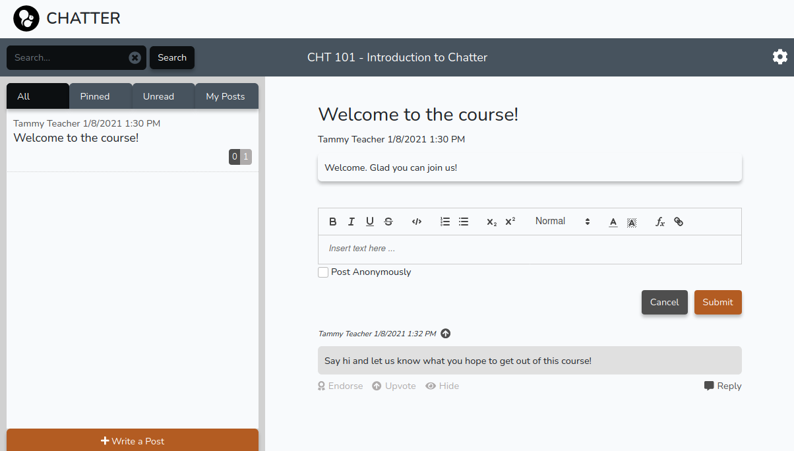

# Chatter

Chatter is an LTI-enabled forum for powering 
class discussions.

## Installation

See the file `INSTALL.md` for installation or upgrade instructions.

## Meta

Chatter is a product of Longhorn Open Ed Tech, a group building open-source education tools housed at the University of Texas at Austin.  See our homepage for more info about us and to discuss collaboration possibilities and ideas for new development.

Distributed under the Gnu Affero license.  See ``LICENSE`` for more information.

## Contributing

We welcome bug reports and feature suggestions via the 'Issues' tab in Github.

If you'd like to contribute a feature or other change, we welcome pull requests.  For new features or other large changes, please open an issue first and tell us what you're proposing.
